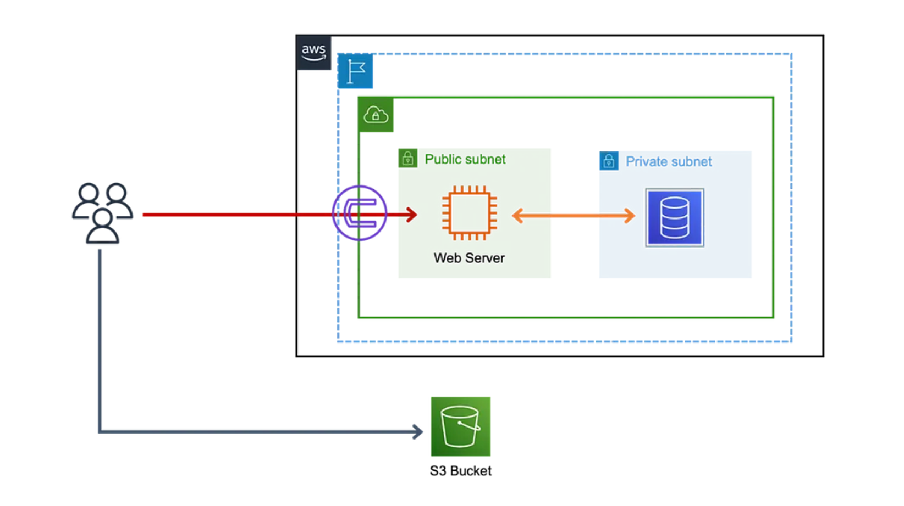

# Examen Práctico de Terraform

## Planteamiento del Problema:

Presentaré una arquitectura AWS para una aplicación. Construirás la aplicación paso a paso, añadiendo servicios y recursos con cada módulo completado. Antes de comenzar, revisemos los requisitos previos.

## Requisitos Previos:

- Cuenta de AWS con permisos para crear instancias EC2 y bases de datos RDS.

## Problema:

En esta práctica, trabajaremos con la VPC DEFAULT de AWS en la región "Norte de Virginia" [us-east-1]. Necesitarás dos subredes: "us-east-1a" y "us-east-1b", y dos grupos de seguridad, uno para acceso público y otro para acceso privado. El grupo de seguridad público permitirá el tráfico en los puertos 80 y 22 para alojar la aplicación web y para la conectividad. Lanzarás una instancia EC2 y configurarás un grupo de seguridad privado para tu base de datos RDS MySQL. Luego, establecerás la conexión entre RDS y EC2, e instalarás el sitio web de WordPress en la instancia. Finalmente, alojarás un sitio web simple de WordPress en la instancia EC2 y exportarás activos estáticos al bucket S3.

## Requerimientos:

Aprovisionar la arquitectura considerando dos posibilidades:

1. **Módulos de Terceros [Terraform]:**
    - s3: [terraform-aws-modules/s3-bucket/aws](https://registry.terraform.io/modules/terraform-aws-modules/s3-bucket/aws/latest)
    - ec2-instance: [terraform-aws-modules/ec2-instance/aws](https://registry.terraform.io/modules/terraform-aws-modules/ec2-instance/aws/latest)
    - security-group: [terraform-aws-modules/security-group/aws](https://registry.terraform.io/modules/terraform-aws-modules/security-group/aws/latest)
    - rds: [terraform-aws-modules/rds/aws](https://registry.terraform.io/modules/terraform-aws-modules/rds/aws/latest)

2. **Módulos Propios:**
    - Crear módulo para s3
    - Crear módulo para ec2
    - Crear módulo para sg
    - Crear módulo para rds

3. **Usar llave SSH**
   - Nombre de la llave ppk = servidor-ppk

3. **UserData:**
    - Se proporciona el archivo `user_data_wp.sh` para la instalación de WordPress en la instancia EC2.

4. **Gestión de Base de Datos:**
    - Ajustar el grupo de seguridad para permitir el tráfico en el puerto 3306 con la base de datos inicial `wordpressdb`.

6. **Repositorio de Terraform:**
    - Subir todo el código de Terraform a un repositorio.

**¡Buena suerte en tu examen!**